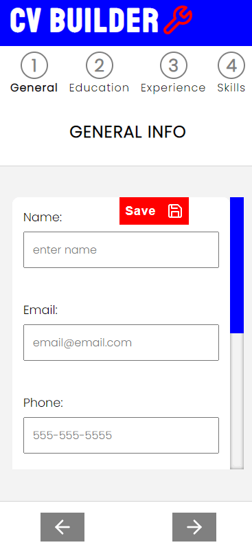
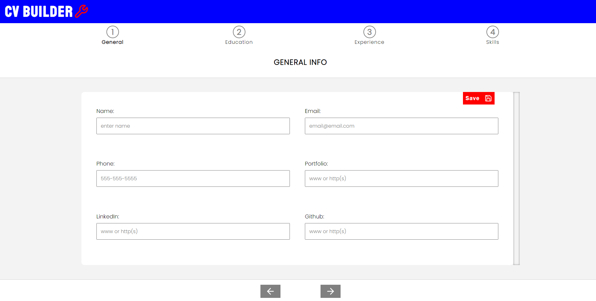
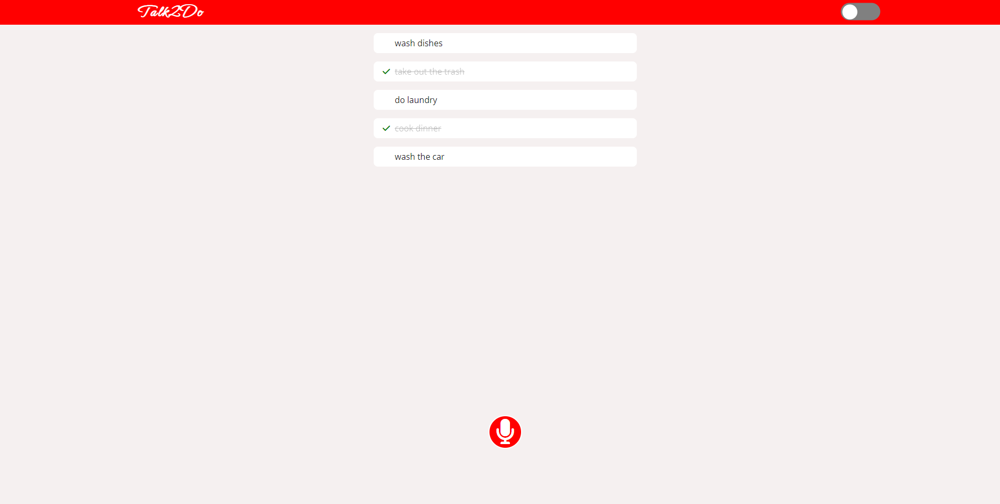
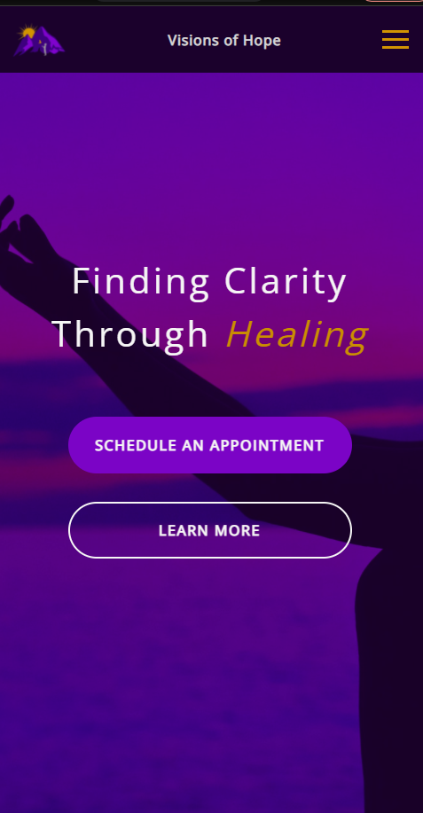
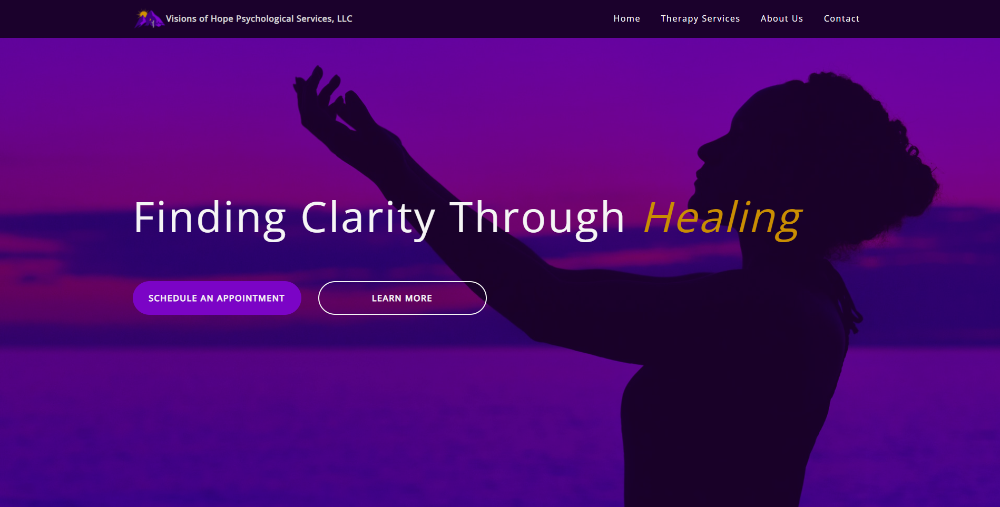

# Peronal Portfolio

This is my personal portfolio website that showcases my featured projects, skills, and about me.

## Table of contents

- [Overview](#overview)
  - [Skills](#skills)
  - [Screenshots](#screenshots)
  - [Links](#links)
- [My process](#my-process)
  - [Built with](#built-with)
- [Author](#author)

## Overview

I am a Self-Taught Front-End Developer/Freelancer who enjoys creating responsive and interactive websites and applications. I am always seeking to learn new skills and increase my knowlege base. Even though my famililarity is with the Front End I am open and interested in learning the back end as well.

I have a Bachelor of Science Degree in Psychology from Old Dominion University along with 11 years of experience in Corrections. I have always had a passion for helping others and I now desire to use technology to provide solutions.

### Skills

- HTML5
- CSS3
- Sass
- JavaScript
- React
- Styled Components

### Screenshots

### Links

Below are links to my featured projects:

CV Builder: 

- Repository URL: [https://github.com/artsycoder533/CV-Builder.git](https://github.com/artsycoder533/CV-Builder.git)
- Live Site URL: [https://artsycoder533.github.io/CV-Builder/](https://artsycoder533.github.io/CV-Builder/)
- Video Demo on Youtube: [https://youtu.be/S-ACy0H7a8s](https://youtu.be/S-ACy0H7a8s)

Talk2Do:

- Repository URL: [https://github.com/artsycoder533/talk2do.git](https://github.com/artsycoder533/talk2do.git)
- Live Site URL: [https://artsycoder533.github.io/talk2do/](https://artsycoder533.github.io/talk2do/)
- Video Demo on Youtube: [https://youtu.be/fNI9YAqRuxM](https://youtu.be/fNI9YAqRuxM)

Visions of Hope Psychological Services, LLC:

- Repository URL: [https://github.com/artsycoder533/VOHPS-LLC.git](https://github.com/artsycoder533/VOHPS-LLC.git)
- Live Site URL: [https://visionsofhope-va.com/](https://visionsofhope-va.com/)
- Video Demo on Youtube: [https://youtu.be/WwilzCSvx8k](https://youtu.be/WwilzCSvx8k)

I am currently working on the following:

Productiv:
- Repository URL: [https://github.com/artsycoder533/productiv.git](https://github.com/artsycoder533/productiv.git)
- Live Site URL: [https://artsycoder533.github.io/productiv/](https://artsycoder533.github.io/productiv/)
- Video Demo on Youtube: [https://youtube.com/playlist?list=PL2WqH02famSWoIjSa2kHPvw6u7Qzsmshx](https://youtube.com/playlist?list=PL2WqH02famSWoIjSa2kHPvw6u7Qzsmshx)

### Built with

- Semantic HTML5 markup
- CSS
- Javascript
- Mobile-first workflow

## Author

- Personal Portfolio - [https://natashajohnson.dev/](https://natashajohnson.dev/)

