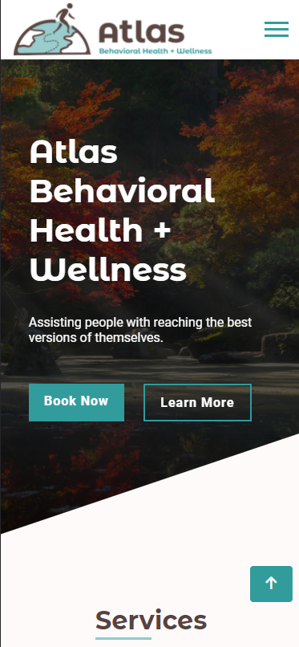
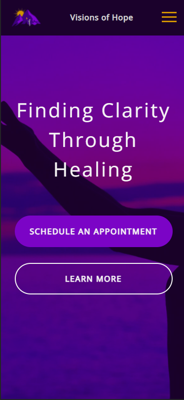

# Peronal Portfolio

Personal portfolio website that showcases my skills through featured projects.

## Table of contents

- [Overview](#overview)
  - [Skills](#skills)
  - [Projects](#projects)
- [My process](#my-process)
  - [Built with](#built-with)
- [Author](#author)

## Overview

I am a Self-Taught Front-End Developer/Freelancer who genuinely enjoys creating responsive and interactive websites and applications. I am always seeking to learn new skills and increase my knowledge base. I created a [YouTube channel](https://www.youtube.com/channel/UCOGjYAACGwNLzYcTpXnvZ_Q) to track my progress, as well as share demo videos of projects I am currently working on.

I have a Bachelor of Science Degree in Psychology from Old Dominion University along with 11 years of experience in Corrections, primarily as a Counselor. I have always had a passion for helping others and I now desire to use technology to provide solutions.

### Skills

- HTML5
- CSS3
- Sass
- JavaScript
- React
- Styled Components

### Projects

Below are links to my featured projects:

1st & Third:

- Repository URL: [https://github.com/artsycoder533/1st-Third.git](https://github.com/artsycoder533/1st-Third.git)
- Live Site URL: [https://artsycoder533.github.io/1st-Third/](https://artsycoder533.github.io/1st-Third/)
- Video Demo Playlist on Youtube: [https://www.youtube.com/playlist?list=PL2WqH02famSU0LDxXBtOHKcplOsu6QYqE](https://www.youtube.com/playlist?list=PL2WqH02famSU0LDxXBtOHKcplOsu6QYqE)

- Screenshots:

  - 
  - 

CV Builder: 

- Repository URL: [https://github.com/artsycoder533/CV-Builder.git](https://github.com/artsycoder533/CV-Builder.git)
- Live Site URL: [https://artsycoder533.github.io/CV-Builder/](https://artsycoder533.github.io/CV-Builder/)
- Video Demo on Youtube: [https://youtu.be/S-ACy0H7a8s](https://youtu.be/S-ACy0H7a8s)

- Screenshots:

  - 
  - 

Atlas Behavioral Health and Wellness (In Progress):

- Repository URL: [https://github.com/artsycoder533/atlas-.git](https://github.com/artsycoder533/atlas-.git)
- Live Site URL: [https://artsycoder533.github.io/atlas-/](https://www.atlasbhw.com/)
- Video Demo on Youtube: [https://youtu.be/vayuWRdryeM](https://youtu.be/vayuWRdryeM)

- Screenshots:

  - 
  - 

Visions of Hope Psychological Services, LLC:

- Repository URL: [https://github.com/artsycoder533/VOHPS-LLC.git](https://github.com/artsycoder533/VOHPS-LLC.git)
- Live Site URL: [https://visionsofhope-va.com/](https://visionsofhope-va.com/)
- Video Demo on Youtube: [https://youtu.be/WwilzCSvx8k](https://youtu.be/WwilzCSvx8k)

- Screenshots:
  - 
  - 

Talk2Do:

- Repository URL: [https://github.com/artsycoder533/talk2do.git](https://github.com/artsycoder533/talk2do.git)
- Live Site URL: [https://artsycoder533.github.io/talk2do/](https://artsycoder533.github.io/talk2do/)
- Video Demo on Youtube: [https://youtu.be/fNI9YAqRuxM](https://youtu.be/fNI9YAqRuxM)

- Screenshots:

  - 
  - 

### Built with

- HTML5
- CSS3
- JavaScript
- Responsive Web Design

## Author

- Personal Portfolio - [https://natashajohnson.dev/](https://natashajohnson.dev/)
- LinkedIn - [https://www.linkedin.com/in/natasha--johnson/](https://www.linkedin.com/in/natasha--johnson/)
- YouTube Channel - [https://www.youtube.com/channel/UCOGjYAACGwNLzYcTpXnvZ_Q](https://www.youtube.com/channel/UCOGjYAACGwNLzYcTpXnvZ_Q)

